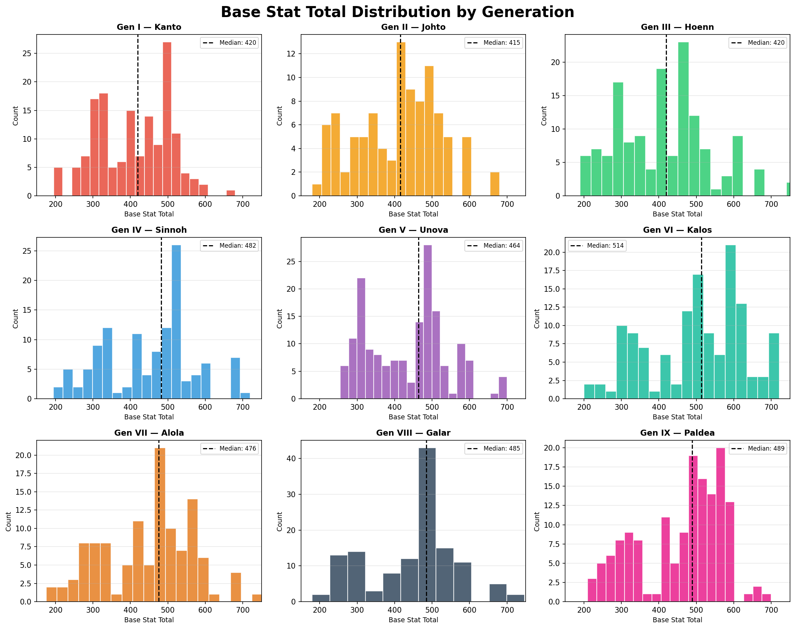
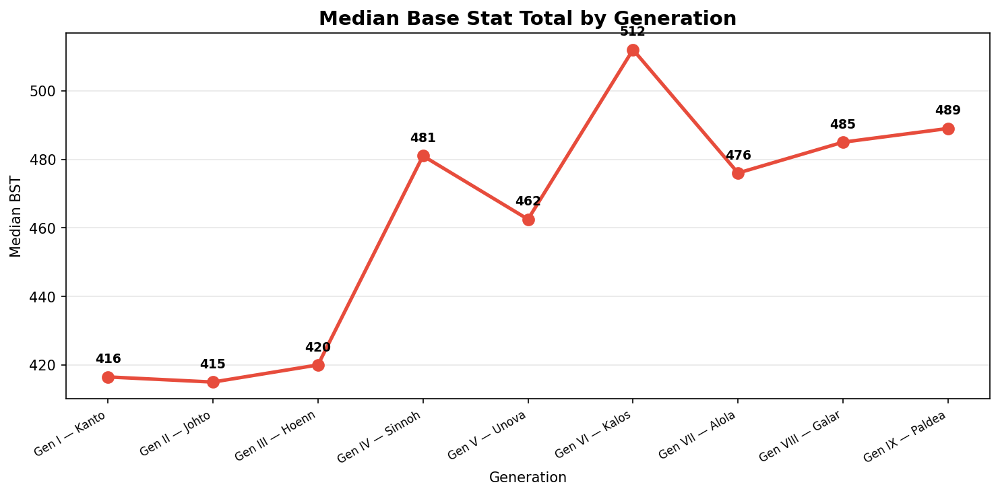

# Power Creep in Pokémon

**Power creep** is a phenomenon in game design where newer content is made progressively stronger than older content — often to keep the game feeling fresh and incentivize players to engage with new releases. Pokémon is a franchise spanning 9 generations and over 1,000 species, making it a fascinating case study.

In this vignette, we explore whether newer Pokémon really are stronger than older ones by analyzing the distribution of **Base Stat Totals (BST)** across generations. BST is the sum of all six base stats (HP, Attack, Defense, Sp. Atk, Sp. Def, Speed) and is the most common single-number measure of a Pokémon's overall strength.

---

## Setup

```py
import polars as pl
import matplotlib.pyplot as plt
from pykemon.db import get_connection

con = get_connection()
pokemon = con.sql("SELECT * FROM pokemon").pl()
df = pokemon.filter(pl.col("generation").is_not_null())
```

---

## BST Distribution by Generation

Each histogram shows the spread of BST for Pokémon introduced in that generation. The dashed line marks the median BST, making it easy to compare across generations at a glance.

=== "Plot Code"

    ```py title="bst_histogram.py" linenums="1"
    gen_labels = {
        1: "Gen I — Kanto",
        2: "Gen II — Johto",
        3: "Gen III — Hoenn",
        4: "Gen IV — Sinnoh",
        5: "Gen V — Unova",
        6: "Gen VI — Kalos",
        7: "Gen VII — Alola",
        8: "Gen VIII — Galar",
        9: "Gen IX — Paldea",
    }

    gen_colors = [
        "#e74c3c", "#f39c12", "#2ecc71", "#3498db",
        "#9b59b6", "#1abc9c", "#e67e22", "#34495e", "#e91e8c"
    ]

    gens = sorted(df["generation"].unique().to_list())

    fig, axes = plt.subplots(3, 3, figsize=(15, 12), sharey=False)
    fig.suptitle("Base Stat Total Distribution by Generation", fontsize=20, fontweight="bold")

    for i, gen in enumerate(gens):
        ax = axes[i // 3][i % 3]
        data = df.filter(pl.col("generation") == gen)["total"].to_list()
        color = gen_colors[i]

        ax.hist(data, bins=20, color=color, edgecolor="white", alpha=0.85)
        median = sorted(data)[len(data) // 2]
        ax.axvline(median, color="black", linestyle="--", linewidth=1.5, label=f"Median: {median:.0f}")
        ax.set_title(gen_labels.get(gen, f"Gen {gen}"), fontsize=11, fontweight="bold")
        ax.set_xlabel("Base Stat Total", fontsize=9)
        ax.set_ylabel("Count", fontsize=9)
        ax.legend(fontsize=8)
        ax.set_xlim(150, 750)
        ax.grid(axis="y", alpha=0.3)

    plt.tight_layout()
    plt.savefig("docs/assets/bst_by_generation.png", dpi=150, bbox_inches="tight")
    plt.show()
    ```



---

## Median BST Over Time

To get a cleaner view of the trend, we plot the median BST per generation as a line chart.

=== "Plot Code"

    ```py title="median_trend.py" linenums="1"
    medians = (
        df
        .group_by("generation")
        .agg(pl.col("total").median().alias("median_bst"))
        .sort("generation")
    )

    gen_list = medians["generation"].to_list()
    bst_list = medians["median_bst"].to_list()

    fig, ax = plt.subplots(figsize=(10, 5))
    ax.plot(gen_list, bst_list, marker="o", linewidth=2.5, markersize=8, color="#e74c3c")

    for gen, bst in zip(gen_list, bst_list):
        ax.annotate(f"{bst:.0f}", (gen, bst), textcoords="offset points",
                    xytext=(0, 10), ha="center", fontsize=9, fontweight="bold")

    ax.set_title("Median Base Stat Total by Generation", fontsize=14, fontweight="bold")
    ax.set_xlabel("Generation")
    ax.set_ylabel("Median BST")
    ax.set_xticks(gen_list)
    ax.set_xticklabels(
        [gen_labels.get(g, f"Gen {g}") for g in gen_list],
        rotation=30, ha="right", fontsize=8
    )
    ax.grid(axis="y", alpha=0.3)
    plt.tight_layout()
    plt.savefig("docs/assets/median_bst_trend.png", dpi=150, bbox_inches="tight")
    plt.show()
    ```



---

## Filtering by Form

You may want to exclude Mega Evolutions or regional forms to focus on base Pokémon only.

```py
# Base forms only (no regional variants or Megas)
base_only = pokemon.filter(pl.col("form_name").is_null())

# Exclude regional forms but keep Megas
no_regionals = pokemon.filter(
    ~pl.col("form_name").str.contains("Alolan|Galarian|Hisuian|Paldean")
)
```

!!! note "Forms and Power Creep"
    Mega Evolutions (Gen VI) and regional forms can inflate the BST ceiling for earlier generations. Filtering to base forms gives a cleaner picture of power creep in the core roster.

---

## Conclusions

A few patterns emerge from the data:

- **Early generations (I–III)** have a wide spread of BSTs, with most Pokémon clustered around 300–450 and a small number of legendaries above 600.
- **Generation VI onward** introduced Mega Evolutions, pushing the upper ceiling significantly higher.
- **The median BST** shows a gradual upward trend — newer ordinary Pokémon are stronger on average than their older counterparts.
- **Power creep is real**, but nuanced — the floor hasn't risen much, but the ceiling keeps climbing and mid-tier Pokémon are consistently stronger in newer generations.

!!! note "Competitive Implications"
    In competitive play, older Pokémon often struggle to keep up with newer generations without access to updated moves or mechanics. BST alone doesn't tell the whole story — movepool, typing, and abilities matter too.
